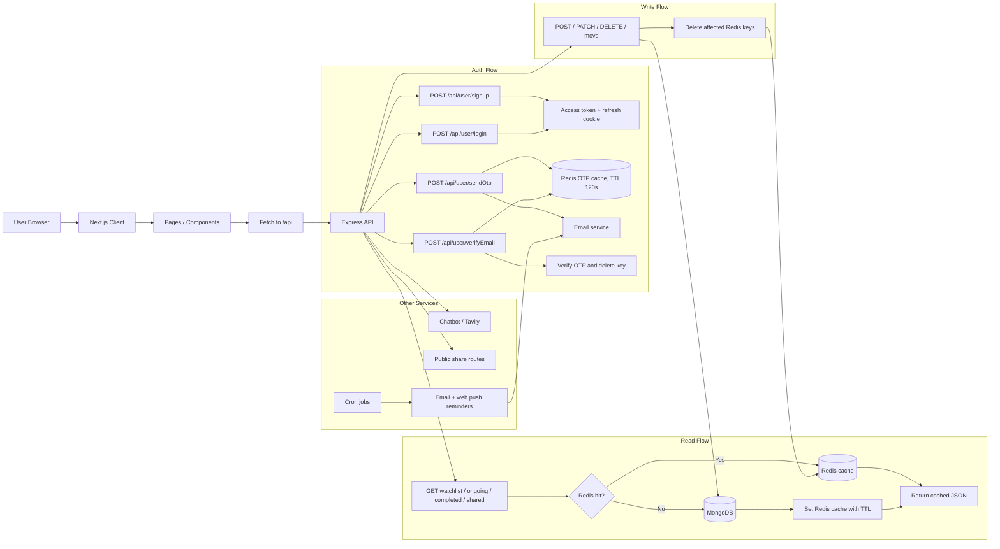

# Kineq (Currently 34 users)

<div style="font-family: -apple-system, BlinkMacSystemFont, &quot;Segoe UI&quot;, Roboto, &quot;Helvetica Neue&quot;, Arial, sans-serif; border: 1px solid rgb(224, 224, 224); border-radius: 12px; padding: 20px; max-width: 500px; background: rgb(255, 255, 255); box-shadow: rgba(0, 0, 0, 0.05) 0px 2px 8px;"><div style="display: flex; align-items: center; gap: 12px; margin-bottom: 12px;"><div style="flex: 1 1 0%; min-width: 0px;"><h3 style="margin: 0px; font-size: 18px; font-weight: 600; color: rgb(26, 26, 26); line-height: 1.3; overflow: hidden; text-overflow: ellipsis; white-space: nowrap;">Kineq</h3><p style="margin: 4px 0px 0px; font-size: 14px; color: rgb(102, 102, 102); line-height: 1.4; overflow: hidden; text-overflow: ellipsis; display: -webkit-box; -webkit-line-clamp: 2; -webkit-box-orient: vertical;">Your AI-Powered Watchlist Organizer Tracker</p></div></div><a href="https://www.producthunt.com/products/kineq?embed=true&amp;utm_source=embed&amp;utm_medium=post_embed" target="_blank" rel="noopener" style="display: inline-flex; align-items: center; gap: 4px; margin-top: 12px; padding: 8px 16px; background: rgb(255, 97, 84); color: rgb(255, 255, 255); text-decoration: none; border-radius: 8px; font-size: 14px; font-weight: 600;">Check it out on Product Hunt →</a></div>
</br>

## Architecture Visualizer



Backend behavior in plain terms:

- GET requests for watchlist, ongoing, completed, and shared views check Redis first, then fall back to MongoDB on cache miss.
- POST, PATCH, DELETE, and move actions write to MongoDB first and then clear the relevant Redis keys so the next GET rebuilds the cache.
- OTP verification uses Redis as a short-lived store for `otp:<email>` and deletes the key after successful verification or expiry.
- Login and signup issue JWT access tokens plus an HTTP-only refresh cookie.
- Chatbot requests go through the backend and use Tavily, while reminder jobs run from cron and trigger mail / web-push notifications.

Kineq is a full-stack web application with LLM-powered semantic search (via Tavily) to track shows/movies across three personal states. Features:

- watchlist
- ongoing
- completed (folder-based)
- link sharing (share folders/lists via unique public links)
- scheduled automated reminder in form of emails and web-push notifications
- chatbot (for searching about movies/series/animes information, getting recommendations, etc)

The project is split into:

- `client/`: Next.js frontend (deployed on Vercel)
- `backend/`: Express + MongoDB + Redis API + Tavily Search(LLM) (Dockerized, deployable on AWS EC2)
- `backend/`: Express + MongoDB + Redis API + Tavily Search (LLM-powered search) (Dockerized, deployable on AWS EC2)

## Quick Links

- Backend detailed documentation: [Backend README](backend/readme.md)

## Project Structure

```text
Kineq/
	client/
		app/
		components/
		lib/
	backend/
		controllers/
		cron/
		middlewares/
		models/
		routes/
		services/
		Dockerfile
		docker-compose.yml
```

## Local Development

### Frontend

```bash
cd client
npm install
npm run dev
```

### Backend

```bash
cd backend
npm install
npm run dev
```

## Deployment Overview

- Frontend: Vercel
- Backend image: GitHub Actions -> Docker Hub
- Backend runtime: AWS EC2 via Docker Compose

The backend CI/CD flow uses SHA-based image tags for immutable deployments and optionally `latest` for convenience.

## Notes

- Keep all sensitive values in environment variables.
- Do not commit `.env` files to the repository.
- For backend endpoint details and env keys, see [Backend README](backend/readme.md).
- Browser cookies: If your browser blocks third-party cookies, the HTTP-only refresh cookie may not be sent during cross-origin token refresh. This can cause frequent logouts or 400 errors for missing refresh token. Allow third-party cookies for the site (or set cookie SameSite=None and secure) to remain logged in longer.
- CORS & runtime caution: Be careful when configuring CORS and cross-origin behavior — incorrect settings can cause abnormal client/server behavior in production. Also pin and verify package versions carefully; mismatched or deprecated libraries (CommonJS vs ESM differences) can cause runtime failures. Pin dependencies and test in a staging environment before production.
